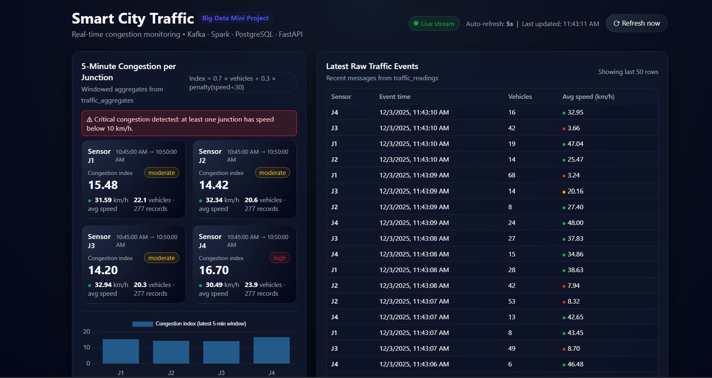
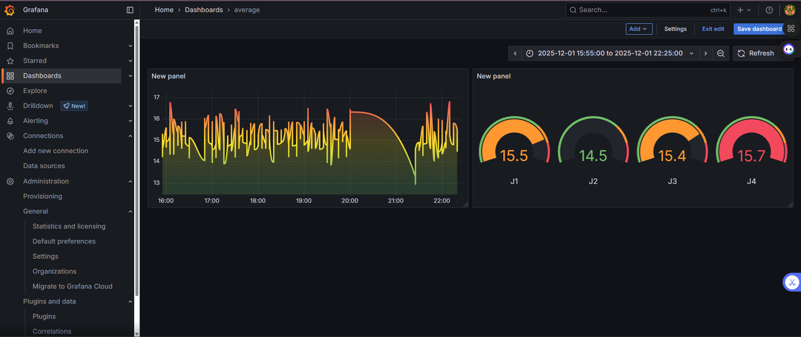

# Smart City Security (Big Data Project) 🚦

## Overview

A real-time traffic monitoring & analytics pipeline for smart cities, using Python, Kafka, Spark Structured Streaming, PostgreSQL, Airflow, FastAPI, and Grafana.



postgradesql monotoring from the grafna 


---

## Architecture

```
smart_city_security/
├── docker-compose.yml
├── dashboard_api.py            # FastAPI backend
├── db_loader.py                # Kafka → PostgreSQL loader
├── traffic_producer.py         # Simulates and publishes sensor events
├── spark/
│   └── traffic_streaming.py    # Spark Streaming job (aggregates)
├── airflow/
│   └── dags/
│       └── smart_city_traffic_batch_dag.py  # Airflow batch job
└── static/
    └── index.html              # Dashboard UI
```

**Main Components:**
- **Kafka**: Sensor event ingestion (`traffic_raw` topic)
- **Producers/Consumers (Python)**: Simulate traffic sensors, load raw data to database
- **Spark Structured Streaming**: Real-time aggregation in 5-minute windows, congestion index
- **Airflow**: Nightly batch to compute daily peak hour
- **PostgreSQL**: Storage (`traffic_readings`, `traffic_aggregates`)
- **FastAPI + Dashboard**: REST APIs and HTML dashboard
- **Grafana**: Visual monitoring/dashboards

---

## Prerequisites

- Docker + Docker Compose
- Python 3.x
- Java 17
- Apache Spark 3.5.x
- Hadoop winutils (Windows only)
- PostgreSQL server (or use Docker)

---

## Quick Start

1. **Initialize Docker Containers**
    ```sh
    docker-compose up -d
    ```
    - Includes Kafka, Zookeeper, PostgreSQL, Grafana.

2. **Set up PostgreSQL**

    - Create database and tables:
      ```sql
      CREATE DATABASE smart_city_traffic;
      \c smart_city_traffic;

      CREATE TABLE IF NOT EXISTS traffic_readings (...);
      CREATE TABLE IF NOT EXISTS traffic_aggregates (...);
      ```
    - Default credentials:
      - User: `postgres`
      - Pass: `0956`
      - DB: `smart_city_traffic`

3. **Environment Variables (Windows example)**

    ```ps1
    $env:HADOOP_HOME = "C:\hadoop"
    $env:JAVA_HOME = "C:\Program Files\Java\jdk-17"
    $env:SPARK_HOME = "C:\spark"
    $env:PYSPARK_PYTHON = "C:\Python314\python.exe"
    $env:Path = "$env:HADOOP_HOME\bin;$env:JAVA_HOME\bin;$env:SPARK_HOME\bin;$env:Path"
    ```

4. **Run Everything (Multiple Terminals)**

    - 🚦 **Kafka producer** (simulates sensors):

        ```sh
        python traffic_producer.py
        ```

    - 📥 **DB Loader** (Kafka → PostgreSQL):

        ```sh
        python db_loader.py
        ```

    - ⚡ **Spark Streaming Aggregates**:

        ```sh
        spark-submit spark/traffic_streaming.py
        ```

    - 📊 **FastAPI Dashboard**:

        ```sh
        uvicorn dashboard_api:app --reload --port 8000
        ```

    - 🕑 **Airflow batch job (peak hour calculation):**

        ```sh
        # In airflow/ directory
        airflow db init
        airflow users create --username admin ...
        airflow webserver
        airflow scheduler
        ```

    - 📈 **Grafana UI**: Open http://localhost:3000

---

## Features

- Real-time sensor event processing
- 5-min traffic aggregates, congestion index
- Daily peak hour analytics (Airflow DAG)
- RESTful APIs for data retrieval
- Dashboard & Grafana for visualization
- Containerized deployment (Docker Compose)

---

## Troubleshooting

- **Hadoop native error:** Ensure `winutils.exe` and `hadoop.dll` are present in `$HADOOP_HOME/bin`
- **Postgres connection:** Check credentials, port, and DB name match defaults
- **Kafka not receiving events:** Check topic name config in all scripts (`traffic_raw`)
- **Dashboard or API not loading:** Make sure backend services (DB Loader, Spark job, FastAPI API) are running

---

## License

MIT (or your chosen license)